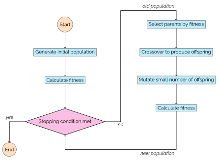

.. image:: https://img.shields.io/pypi/v/edo.svg
   :target: https://pypi.org/project/edo/

.. image:: https://travis-ci.com/daffidwilde/edo.svg?branch=master
    :target: https://travis-ci.com/daffidwilde/edo

.. image:: https://coveralls.io/repos/github/daffidwilde/edo/badge.svg?branch=master&service=github
   :target: https://coveralls.io/github/daffidwilde/edo?branch=master

.. image:: https://img.shields.io/badge/code%20style-black-000000.svg
   :target: https://github.com/ambv/black

.. image:: https://zenodo.org/badge/139703799.svg
   :target: https://zenodo.org/badge/latestdoi/139703799

Evolutionary Dataset Optimisation
*********************************

A library for generating artificial datasets through genetic evolution.
=======================================================================
Typically, when faced with a problem in data science, the data is fixed and the
researcher must select an algorithm that suits both the problem and performs
well on the data. This is typically done by running multiple algorithms on the
dataset or by justifying a choice based on the findings of the current
literature. But what makes that data "good" for the algorithm? Why is it that an
algorithm performs well on some datasets and not others?

The purpose of this library is to create a population of families of datasets
for which a specific algorithm performs well with respect to its objective
function. This function is passed to a genetic algorithm (GA) where each
individual represents a family of datasets defined by their dimensions, and the
statistical shape of each of its columns. The fitness of an individual is taken
using some amalgamation of the fitnesses from a sample of datasets belonging to
its family.

Through this genetic algorithm, the hope is to not only build up banks of
effective datasets for a particular algorithm but to give the user the ability
to determine and study the preferred characteristics of such datasets.

Moreover, since this GA can take any fitness function as argument, two or more
algorithms can be compared at once. For example, by considering two similar
algorithms :math:`A` and :math:`B` with fitness functions :math:`f_A` and
:math:`f_B` respectively. Then for a suitable dataset :math:`X` consider the
fitness function, denoted by :math:`f`, and
given by:

.. math::
    f(X) = f_A(X) - f_B(X)

This fitness function, when passed to the GA, will attempt to generate
individuals for which algorithm :math:`A` outperforms algorithm :math:`B`.

What is a genetic algorithm?
============================
Genetic algorithms (GAs) form a branch of search and optimisation methods that
utilise the concept of natural selection. GAs work by creating populations of
individuals based on their fitness. These individuals are potential solutions in
the search space and are typically represented by a string of "alleles".
Together, these alleles form a "chromosome" representation. Most GAs, regardless
of their application, have the following operators:

* **Selection:** A method for selecting a subset of individuals from the current
  population for producing the next. Almost always based on the fitness of the
  individuals.
* **Crossover:** An operator on two individuals, often deemed to be "parents",
  that creates one or more "offspring".
* **Mutation:** Takes each new offspring in turn and changes ("mutates") each of
  their alleles with some probability.

A schematic of a generic GA is given below.

.. include:: INSTALLATION.rst
