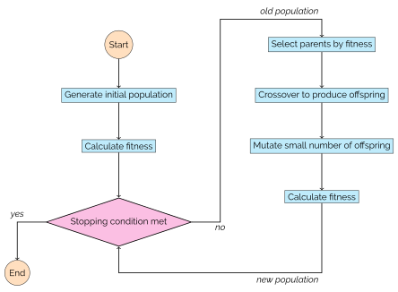

What is a genetic algorithm?
----------------------------

Evolutionary algorithms (EAs) form a branch of population-based optimisation
meta-heuristics inspired by the structures and mechanisms of evolutionary
biology, and are widely recognised to be formally introduced in the 1970s by the
multi-disciplined scientist John Holland in [Holland1975]_. The term "genetic
algorithm" is typically reserved for members of a rather specific subset these
search space optimisation methods that use a "chromosome" representation for the
individuals in its populations.

In this library, as is commonly done, this distinction is overlooked and the two
terms are used interchangeably.

Most importantly, the defining features of this family of algorithms are their
operators. More detailed summaries of them are given in this section of the
documentation but briefly they are:

- **Selection:** The process by which individuals are plucked from a population
  to be carried forward into the next generation after being blended together to
  form offspring with favourable qualities.
- **Crossover:** The blending process. Here, pairs of individuals are combined
  to form one or more new individuals to be added into the next generation.
- **Mutation:** Once a new individual has been made and before they are
  introduced into the population, there is a small chance that they can be
  altered slightly.

The general structure of a basic EA is given below:

