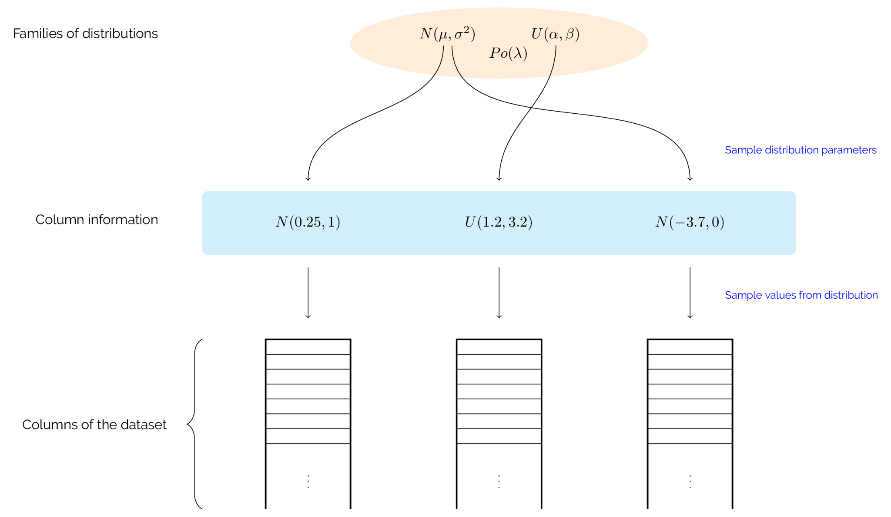

Individuals and the population
------------------------------

Representation
++++++++++++++

At the beginning of a EA, a collection of *individuals* are generated. This
collection is called a *population* or *generation*. Typically, these
individuals are created by randomly sampling parameters from a search space --
though `other methods exist
<https://en.wikipedia.org/wiki/Latin_hypercube_sampling>`_. Each individual
represents a solution to the problem at hand; in the case of genetic algorithms,
this representation is a bit string or *chromosome* as it imitates an actual
genetic chromosome.

The EDO method deals with the creation and adjustment of entire datasets. As
such, there is no encoding to that aspect of an individual. In addition to this
dataset, individuals are represented by a list of probability distributions.
Each of these distributions acts a set of instructions on how to create, inherit
from and mutate the values of the corresponding column in the dataset. These
objects are stored as class attributes in the :class:`edo.individual.Individual`
class.

.. _create-ind:

Creation
++++++++

The parameter space from which individual datasets are generated is defined by
the ``row_limits``, ``col_limits`` and ``families`` parameters in
:class:`edo.DataOptimiser`. The first two describe the dimensional limits of the
dataset (i.e. how tall or wide it can be) while the latter is a pool of families
of probability distributions with which to fill in the dataset.

.. note::

    You can consider a family as a sort of factory that manages and distributes
    independent copies of a particular probability distribution.

The step of creating an individual is to sample a number of rows and columns,
creating a "skeleton" to be filled. Then, according to any family-specific
limits defined in ``col_limits``, each column is filled with values by:

1. Sampling a family from the pool.
2. Creating a new (or using an existing) copy of that family's distribution.
3. Creating an instance of that distribution and sampling values from it to fill
   the column.

A diagram depicting this process is given below:

