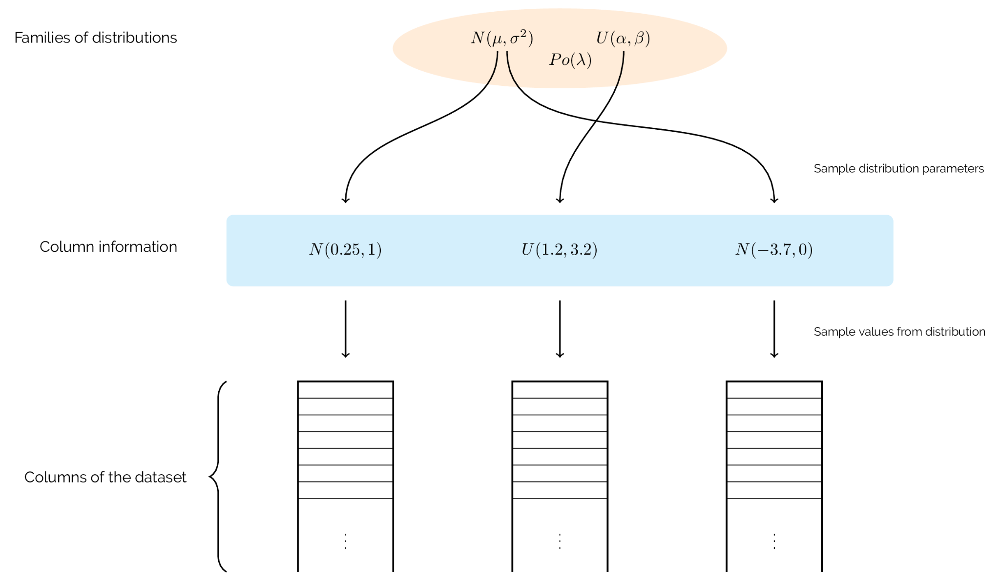

Individuals
-----------

Representation
++++++++++++++

At the beginning of any GA, an initial population of individuals is generated.
Typically, these individuals are created by sampling from a parameter space at
random -- though `other methods exist
<https://en.wikipedia.org/wiki/Latin_hypercube_sampling>`_ to get the most out
of the parameter space.

Each individual represents a solution to the problem at hand and would
classically be given in the form of a bit string to imitate genetics more
closely. Some people would say that this implimentation is not a genetic
algorithm as this convention is not followed here.

We believe that more meaningful manipulation of datasets can be done when they
are left as such rather than compressing the information to obtain a bit string.
We also believe that what makes an evolutionary algorithm genetic is the
inclusion of biological operators for selection, crossover and mutation.

So, in Edo, we represent individuals by both a physical dataset with rows and
columns, and a list of probability distributions. Each distribution acts a set
of instructions on how to create and mutate the values of the corresponding
column in the dataset. More specifically, these quantities are contained in a
single :code:`namedtuple` object.

.. note::

   If you're unfamiliar with how named tuples work, they are somewhere between a
   class and a tuple that is both lightweight and mutable. If you want to learn
   more, you can go and read the `documentation
   <https://docs.python.org/2/library/
   collections.html#collections.namedtuple>`_.

.. _create-ind:

Creation
++++++++

The parameter space from which individual datasets are generated is defined by
the :code:`row_limits`, :code:`col_limits` and :code:`pdfs` parameters in
:code:`run_algorithm`. The first two describe the dimensional limits of the
dataset (i.e. how tall or wide it can be) while the latter is a pool of families
of probability distributions with which to fill in the dataset.

Once the number of rows and columns have been sampled, a family of distributions
is sampled from the pool, and an instance of that distribution is created --
once for each column. These instances are stored for future operations, and
values are sampled from them to fill their respective column in the dataset. A
schematic of how this is done is given below:

