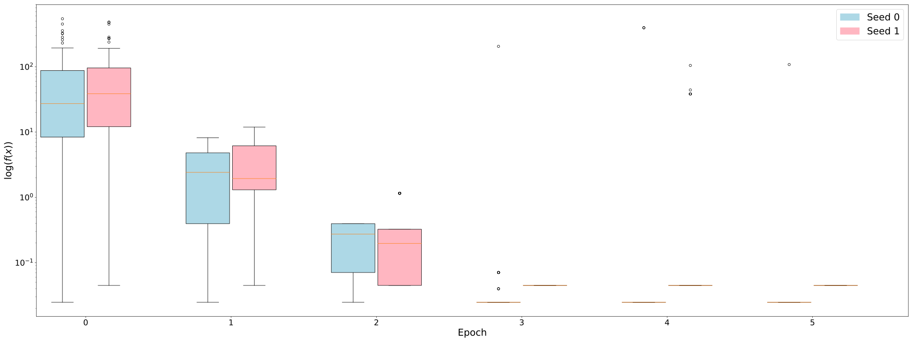

Set a seed
==========

Seeds are controlled by the :code:`seed` parameter in :code:`run_algorithm` and
should be integer.

.. note::
   Without one, the GA here will just fall back on Numpy's innate pseudo-random
   number generator making any results inconsistent between runs.

Consider the setting from the :ref:`first tutorial <refs-tutorial-i>`. We will
obtain inconsistent results by running the algorithm twice using two values of
:code:`seed`.

Run the algorithm with one seed::

   >>> pop, fit, all_pops, all_fits = edo.run_algorithm(
   ...     x_squared,
   ...     size=100,
   ...     row_limits=[1, 1],
   ...     col_limits=[1, 1],
   ...     pdfs=[Normal],
   ...     max_iter=5,
   ...     seed=0
   ... )

And again, with another seed::

   >>> new_pop, new_fit, new_all_pops, new_all_fits = edo.run_algorithm(
   ...     x_squared,
   ...     size=100,
   ...     row_limits=[1, 1],
   ...     col_limits=[1, 1],
   ...     pdfs=[Normal],
   ...     max_iter=5,
   ...     seed=1
   ... )

Now, by looking at the first individual in the final population for each run, we
see they are different::

   >>> pop[0], new_pop[0]
   (Individual(dataframe=          0
    0 -0.157215, metadata=[Normal(mean=-9.62, std=6.18)]),
    Individual(dataframe=          0
    0  0.211628, metadata=[Normal(mean=3.89, std=4.14)]))

For further verification, we can look at the fitness progression::

   >>> import numpy as np
   >>> import matplotlib.pyplot as plt
   >>> from matplotlib.patches import Patch

   >>> fig, ax = plt.subplots(1, figsize=(32, 12), dpi=300)

   >>> width = 0.3
   >>> epsilon = 0.01
   >>> positions = np.arange(len(all_fits))
   >>> shift = 0.5 * width + epsilon

   >>> old = ax.boxplot(
   ...     all_fits,
   ...     positions=positions - shift,
   ...     widths=width,
   ...     patch_artist=True
   ... )

   >>> new = ax.boxplot(
   ...     new_all_fits,
   ...     positions=positions + shift,
   ...     widths=width,
   ...     patch_artist=True
   ... )

   >>> ax.set_xticks(positions)
   >>> ax.set_xticklabels(positions)
   >>> ax.set_yscale('log')
   >>> ax.set_xlabel('Epoch', fontsize=24)
   >>> ax.set_ylabel(r'$\log (f(x))$', fontsize=24)

   >>> for plot, colour in zip([old, new], ['lightblue', 'lightpink']):
   ...     for patch in plot['boxes']:
   ...         patch.set_facecolor(colour)

   >>> for label in ax.get_xticklabels() + ax.get_yticklabels():
   ...     label.set_fontsize(20)

   >>> ax.legend(
   ...     handles=[Patch(color='lightblue'), Patch(color='lightpink')],
   ...     labels=['Seed 0', 'Seed 1'],
   ...     fontsize=24
   ... )

   >>> plt.show()

