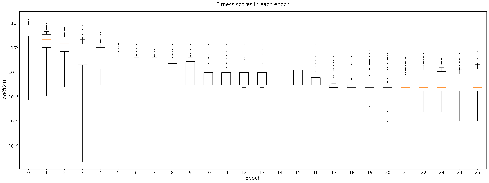

.. _optimise_sample_mean:

Optimising a sample mean
------------------------

The problem
+++++++++++

Given a set of :math:`n \in \mathbb{N}` numbers, :math:`X`, we can consider
:math:`X` to be a dataset with a single column (attribute) and :math:`n` rows
(instances). Let :math:`Y = \{y_1, \ldots y_5\}` be a random sample of five
elements from :math:`X`. We define the fitness, :math:`\ f : \mathbb{R}^n \to
\mathbb{R}`, of our dataset :math:`X` to be the square of the mean of our
sample, :math:`Y`. That is:

.. math::
    f(X) = \bar Y^2, \quad
    \text{where} \quad
    \bar Y = \frac{1}{5} \sum_{i = 1}^{5} y_i

Again, let our objective be to minimise this fitness function. 

In terms of the genetic algorithm, we would expect an optimal solution to this
problem to be a dataset, :math:`X`, whose entries have a mean of 0. This is due
to the fact that the sample mean is an unbiased estimator to a population mean,
i.e.:

.. math::
    \mathbb{E}(\bar Y) = \bar X

For the sake of computational time, we will constrain :math:`n` to be between 5
and 50. Again, let us assume that each set of numbers is sampled from a normal
distribution from :math:`\mathcal{N}` as in the previous tutorial.

Formulation
+++++++++++

This problem is a little more complex than optimising a function like
:math:`f(x) = x^2` so we'll keep the population size the same but increase the
maximum number of iterations to 25. Other than that, we'll keep all the other
settings the same.

Import the libraries::

    >>> import genetic_data as gd
    >>> import matplotlib.pyplot as plt

First we define the new fitness function::

    >>> def sample_mean_squared(df):
    ...     return df.sample(5, replace=True).mean().mean() ** 2

Then we adjust the limits on the number of rows a dataset can take and run the
GA again with :code`sample_mean_squared` as its fitness function::

    >>> pop, fit, all_pops, all_fits = gd.run_algorithm(
    ...     fitness=sample_mean_squared,
    ...     size=100,
    ...     row_limits=[5, 50],
    ...     col_limits=[1, 1],
    ...     max_iter=25,
    ...     maximise=False,
    ...     seed=0
    ... )

Seems simple enough. Let's have a look at the results.

Visualising results
+++++++++++++++++++

The fitness function isn't as easily visualised as in :ref:`optimise_xsquared`,
so instead let us consider how the fitnesses are distributed in each timestep.

We'll do this using boxplots, and to discern between between population
fitnesses in later timesteps, we will use a logarithmic scale::

    >>> fig, ax = plt.subplots(1, figsize=(32, 12), dpi=300)

    >>> ax.boxplot(all_fits, positions=range(len(all_fits)), sym='.')

    >>> ax.set_title(f'Fitness scores in each epoch', size=24, pad=25)
    >>> ax.set_yscale('log')
    >>> ax.set_xlabel('Epoch', size=24)
    >>> ax.set_ylabel(r'$\log(f(X))$', size=24)

    >>> plt.tight_layout()
    >>> plt.show()

Running the above code gives the following plot:

