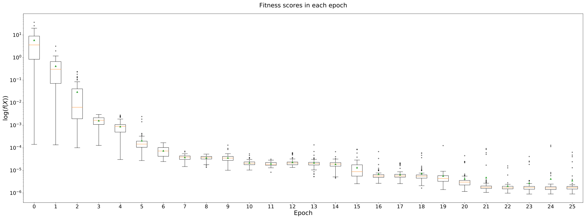

Approximating the mean
======================

Let :math:`X` be a dataset, with one column and :math:`n` rows. We wish to
approximate the mean of :math:`X` using a sample of five of its elements,
denoted by :math:`Y`. Therefore, we define the fitness of our dataset :math:`X`
to be the squared error between the sample mean and the true mean.

It should be clear that our objective is to minimise this function, and in terms
of the genetic algorithm, we would expect an optimal solution to this problem to
be a dataset whose entries have a variance of 0.

For the sake of computational time, we will constrain :math:`n` to be between 5
and 50. Let us assume that each set of numbers is sampled from a normal
distribution in the same fashion as the previous tutorial.

Formulation
-----------

This problem is a little more complex than optimising a function like
:math:`f(x) = x^2` so we'll keep the population size the same but increase the
maximum number of iterations to 25. Other than that, we'll keep all the other
settings the same.

First, import the library and distribution class::

    >>> import edo
    >>> from edo.pdfs import Normal

Now we define the fitness function, incorporating some :ref:`smoothing
<smoothing>` to help account for the random sampling::

    >>> def squared_error(df, num_samples=50):
    ...     errors = []
    ...     for _ in range(num_samples):
    ...        sample_mean = df.sample(5, replace=True).mean().mean()
    ...        errors.append((df.mean().mean() - sample_mean) ** 2)
    ...     return sum(errors) / len(errors)

Then we adjust the limits on the number of rows a dataset can take and run the
GA again with our new fitness function::

    >>> pop, fit, all_pops, all_fits = edo.run_algorithm(
    ...     fitness=squared_error,
    ...     size=100,
    ...     row_limits=[5, 50],
    ...     col_limits=[1, 1],
    ...     pdfs=[Normal],
    ...     max_iter=25,
    ...     seed=0
    ... )

Simple enough. Let's have a look at the results.

Visualising results
-------------------

The fitness function isn't as easily visualised as in the first tutorial. So,
instead, let us consider how the fitnesses are distributed in each timestep.

We'll do this using boxplots, and to discern between between population
fitnesses in later timesteps, we will use a logarithmic scale::

    >>> import matplotlib.pyplot as plt

    >>> fig, ax = plt.subplots(1, figsize=(32, 12), dpi=300)

    >>> box = ax.boxplot(all_fits, positions=range(len(all_fits)), sym='.', showmeans=True)

    >>> title = ax.set_title(f'Fitness scores in each epoch', size=24, pad=25)
    >>> ax.set_yscale('log')
    >>> xlabel = ax.set_xlabel('Epoch', size=24)
    >>> ylabel = ax.set_ylabel(r'$\log(f(X))$', size=24)

    >>> for label in ax.get_xticklabels() + ax.get_yticklabels():
    ...     label.set_fontsize(20)

    >>> plt.tight_layout()
    >>> plt.show()

Running the above code gives the following plot:

