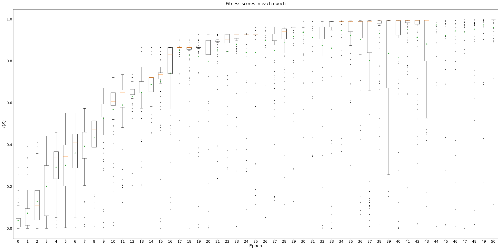
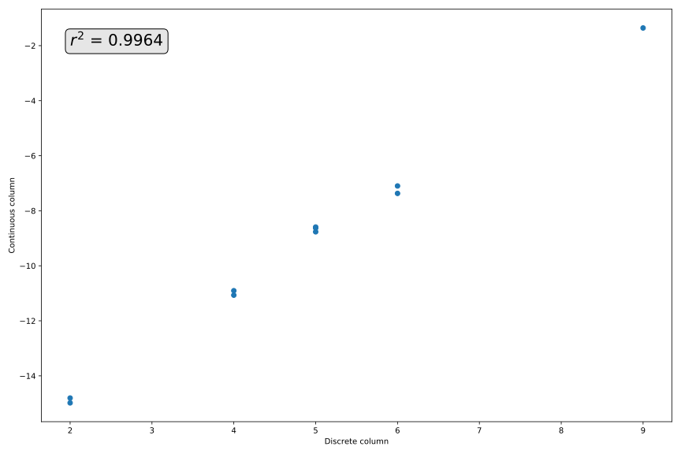

Correlating two columns
=======================

Consider the task of finding two perfectly correlated, equally sized sets of
numbers. Suppose there is also the constraint that one of these sets must be
discrete and the other continuous.

Formulation
-----------

An objective function for such an algorithm could simply be the square of
the r-value, or the coefficient of determination, between the two sets. We can
obtain this objective function using SciPy::

   >>> from scipy.stats import linregress

   >>> def r_squared(df):
   ...     """ Return the square of the r-value between the columns of `df`. """
   ... 
   ...     _, _, r, _, _ = linregress(df.iloc[:, 0].values, df.iloc[:, 1].values)
   ...     return r ** 2

We can run this objective function through Edo as normal -- albeit with some
slightly more complex parameters. For the sake of this example, allow the size
of these sets to be between 10 and 50 numbers, and let the continous and
discrete columns be modelled by normal and Poisson distributions respectively.
We can accommodate the constraint on the types of the columns by using tuple
limits within :code:`col_limits`::

   >>> import edo
   >>> from edo.pdfs import Normal, Poisson

   >>> pop, fit, all_pops, all_fits = edo.run_algorithm(
   ...     fitness=r_squared,
   ...     size=100,
   ...     row_limits=[10, 50],
   ...     col_limits=[(1, 1), (1, 1)],
   ...     pdfs=[Normal, Poisson],
   ...     max_iter=50,
   ...     maximise=True,
   ...     seed=0
   ... )

Visualising results
-------------------

To visualise the results, you can use boxplots again but it may be more
beneficial to not use a logarithmic scale::

   >>> import matplotlib.pyplot as plt

   >>> fig, ax = plt.subplots(1, figsize=(40, 20), dpi=300)

   >>> ax.boxplot(
   ...     all_fits, positions=range(len(all_fits)), sym='.', showmeans=True
   ... ) #doctest:+SKIP

   >>> ax.set_title('Fitness scores in each epoch', size=24, pad=25) #doctest:+SKIP
   >>> ax.set_xlabel('Epoch', size=24) #doctest:+SKIP
   >>> ax.set_ylabel(r'$f(X)$', size=24) #doctest:+SKIP

   >>> for label in ax.get_xticklabels() + ax.get_yticklabels():
   ...     label.set_fontsize(20)

   >>> plt.show() #doctest:+SKIP

We can also take a look at the best individual in the final population::

   >>> import numpy as np

   >>> best = np.argmax(fit)
   >>> best_individual = pop[best]
   >>> df = best_individual.dataframe

   >>> fig, ax = plt.subplots(1, figsize=(12, 8), dpi=300)

   >>> ax.scatter(df.select_dtypes('int'), df.select_dtypes('float')) #doctest:+SKIP
   >>> ax.annotate(
   ...     s=r'$r^2$ + f' = {np.round(fit[best], 4)}',
   ...     xy=[2, -2],
   ...     fontsize=20,
   ...     bbox=dict(boxstyle='round', fc='0.9')
   ... ) #doctest:+SKIP
   
   >>> ax.set_xlabel('Discrete column') #doctest:+SKIP
   >>> ax.set_ylabel('Continuous column') #doctest:+SKIP

   >>> plt.show() #doctest:+SKIP

